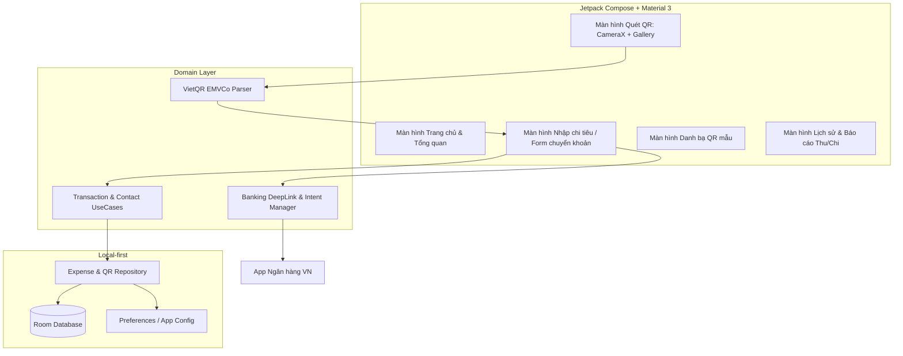
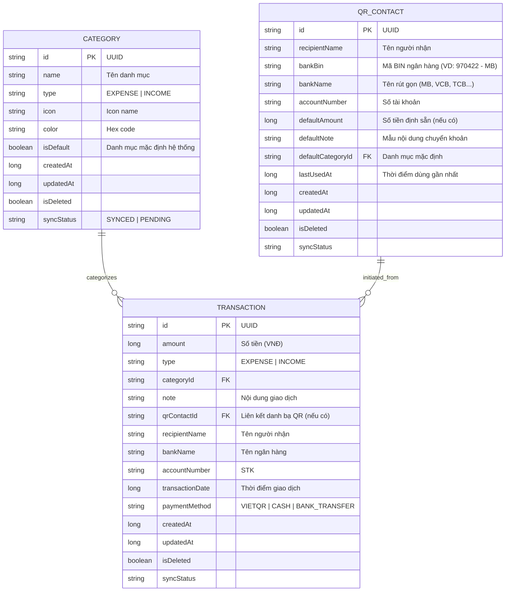

# Kế hoạch Triển khai: Ứng dụng Quản lý Chi tiêu "Your History" (Android Kotlin)

## 1. Mục tiêu & Bài toán thực tế
Xây dựng ứng dụng Android quản lý tài chính cá nhân với trọng tâm là **sự tiện lợi khi thanh toán/chuyển khoản qua mã VietQR**:
- **Khắc phục bất tiện**: Mỗi lần chuyển khoản phải mở app ngân hàng, quét QR, nhập tay lý do/nội dung chuyển khoản. Khi thanh toán tiền ăn trưa, mua sắm định kỳ hoặc cho người quen, người dùng phải tìm lại ảnh QR cũ.
- **Giải pháp của Your History**:
  1. Quét QR một lần (từ Camera hoặc Gallery ảnh) -> Lưu danh bạ QR kèm danh mục (VD: Cơm trưa, Cà phê) và mẫu nội dung (VD: "Thang chuyen tien com").
  2. Bấm "Chuyển tiền & Lưu chi tiêu": Ứng dụng tự động lưu lịch sử chi tiêu vào máy, gọi Intent mở thẳng App Ngân hàng (hoặc Deep Link Napas/VietQR) với số tiền và nội dung đã thiết lập sẵn.
  3. Cơ chế Fallback thông minh: Tự động copy số tài khoản, số tiền và nội dung vào Clipboard nếu app ngân hàng đích không nhận trực tiếp intent params.
  4. Quản lý cả Thu và Chi, thống kê trực quan.
  5. Local-first: Dữ liệu an toàn trên thiết bị bằng Room Database (quan hệ) + DataStore Preferences (cài đặt), sẵn sàng đồng bộ Cloud sau này.
  6. GitHub Actions CI: Tự động build và xuất file `app-debug.apk` mỗi khi push lên nhánh `main`, cấu hình tối ưu thời gian build tối đa.

---

## 2. Kiến trúc & Công nghệ (Tech Stack)

- **Ngôn ngữ**: Kotlin 1.9.24 (JVM Target 17).
- **UI**: Jetpack Compose (BOM 2024.06.00) + Material 3 + Jetpack Navigation 2.7.7.
- **Dependency Injection**: Koin 3.5.6 (nhẹ, build nhanh trên GitHub Actions, không cần sinh code KSP nặng nề như Hilt).
- **Local Storage**: Room Database 2.6.1 + DataStore Preferences 1.1.1.
- **Asynchronous**: Kotlin Coroutines 1.8.1 + Flow / StateFlow.
- **Scanner**: Google ML Kit Barcode Scanning 17.2.0 + CameraX 1.3.4.
- **CI/CD**: GitHub Actions (`ubuntu-latest`) với cấu hình Gradle cache, tắt daemon thừa.

---

## 3. Thiết kế Cơ sở dữ liệu (Local-first Schema)

Mọi bảng đều tuân theo quy chuẩn đồng bộ hóa Cloud tương lai:

---

## 4. Chi tiết Giải thuật VietQR & Handoff sang Ngân hàng

### 4.1. Chuẩn VietQR EMVCo Specification
Mã VietQR tuân thủ chuẩn EMVCo QR Code với cấu trúc Tag-Length-Value (TLV):
- `Tag 00`: Payload Format Indicator (01)
- `Tag 01`: Point of Initiation Method (11: Static QR, 12: Dynamic QR có sẵn số tiền)
- `Tag 38`: Merchant Account Information (Napas VietQR)
  - Subtag 00: GUID (`A000000727`)
  - Subtag 01: Beneficiary Bank BIN (6 chữ số, ví dụ `970422` cho MB, `970436` cho Vietcombank) + Số tài khoản
  - Subtag 02: Service Code (`QRIBFTTA` - Chuyển nhanh qua Napas 247)
- `Tag 54`: Transaction Amount (Số tiền)
- `Tag 58`: Country Code (`VN`)
- `Tag 62`: Additional Data Field
  - Subtag 08: Purpose of Transaction (Nội dung chuyển tiền)

### 4.2. Luồng Chuyển tiền (Banking Handoff)
1. **Bước 1 - Tạo / Kiểm tra Deep Link**:
   - Sử dụng chuẩn `https://api.vietqr.io/{bankBin}/{accountNumber}?amount={amount}&memo={memo}` hoặc format scheme `vietqr://transfer?bank={bankBin}&account={accountNumber}&amount={amount}&memo={memo}`.
2. **Bước 2 - Copy thông minh vào Clipboard**:
   - Tự động copy nội dung chuyển khoản hoặc STK vào clipboard kèm thông báo Toast ngắn.
3. **Bước 3 - Khởi chạy Intent**:
   - Thử mở qua URL/Deep Link bằng Intent (`ACTION_VIEW`).
   - Nếu không có app ngân hàng nào bắt intent, cung cấp hộp thoại chọn các app ngân hàng phổ biến được cài trên máy (truy vấn danh sách package name qua `PackageManager`: VCB Digibank, MB Bank, Techcombank Mobile, TPBank, etc.) để mở trực tiếp.

---

## 5. Quy trình Triển khai từng bước (Execution Steps)

### Bước 1: Thiết lập Project Android & GitHub Actions CI Tối ưu
- Khởi tạo thư mục gốc Android Gradle (`settings.gradle.kts`, `build.gradle.kts`, `gradle/wrapper`, `gradle.properties`).
- Tối ưu `gradle.properties`:
  - `org.gradle.jvmargs=-Xmx2048m -XX:+UseG1GC`
  - `org.gradle.parallel=true`
  - `org.gradle.caching=true`
  - `android.useAndroidX=true`
  - `kotlin.incremental=false`
- Tạo workflow `.github/workflows/build-apk.yml`:
  - Cache Gradle dependencies bằng `gradle/actions/setup-gradle`.
  - Task chạy: `./gradlew assembleDebug --no-daemon -x test -x lint -x lintVitalAnalyzeRelease`.
  - Upload `app-debug.apk` lên GitHub Actions Artifacts để tải về cài ngay.

### Bước 2: Xây dựng Core & Data Layer
- Khởi tạo Room Database, các Entity (`TransactionEntity`, `CategoryEntity`, `QrContactEntity`), DAOs, DataStore Preferences.
- Cài đặt Repository Pattern và bộ dữ liệu mẫu ban đầu (Default Categories: Ăn uống, Di chuyển, Mua sắm, Tiêu vặt, Tiền lương, v.v.).

### Bước 3: Module Xử lý VietQR & Camera Scanner
- Xây dựng `VietQrParser`: Bóc tách chuỗi QR EMVCo thành object có đầy đủ thông tin: Mã ngân hàng, STK, Số tiền, Nội dung.
- Xây dựng giao diện quét CameraX và tích hợp bộ chọn ảnh thư viện (`ActivityResultContracts.PickVisualMedia`).

### Bước 4: Module Quản lý Danh bạ QR & Handoff Ngân hàng
- Xây dựng `BankingHandoffManager`: Quản lý danh sách package ngân hàng VN, hỗ trợ tạo Napas VietQR DeepLink, copy clipboard, và mở app ngân hàng tương ứng.
- Màn hình Quản lý Danh bạ QR (Lưu QR người thân, quán quen, đặt trước nội dung).

### Bước 5: Màn hình Ghi chép Chi tiêu & Báo cáo (UI/UX)
- Màn hình Trang chủ: Thống kê số dư/chi tiêu tháng này, nút quét QR nhanh, danh bạ chuyển khoản 1 chạm.
- Màn hình Lịch sử & Chi tiết giao dịch: Tìm kiếm, lọc theo danh mục/tháng.
- Hoàn thiện giao diện Material 3 mượt mà với Dark/Light theme.

---

## 6. Kế hoạch Kiểm thử & Xác nhận (Verification)
1. **Kiểm tra cú pháp & cấu hình Gradle**: Đảm bảo toàn bộ cấu hình Gradle và source code Kotlin biên dịch sạch sẽ.
2. **Kiểm tra GitHub Actions**: Khi đẩy code lên GitHub, Action tự kích hoạt và sinh ra file `app/build/outputs/apk/debug/app-debug.apk`.
3. **Kiểm tra tính năng thực tế**:
   - Quét thử ảnh QR ngân hàng thực tế (MB Bank, VCB).
   - Kiểm tra việc parse ra đúng STK, Ngân hàng, Nội dung.
   - Thử mở sang app ngân hàng và kiểm tra việc sao chép nội dung/STK vào clipboard.
